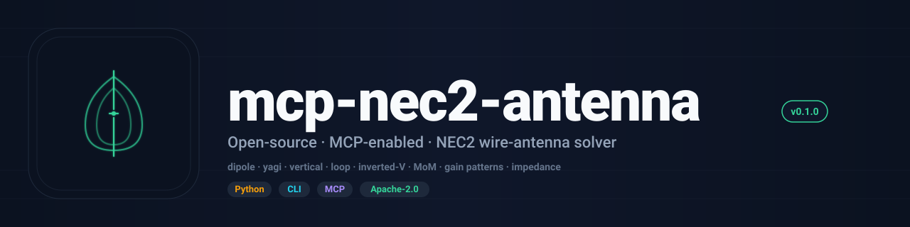

<div align="center">



<br/>

[](LICENSE)
[](https://www.python.org/downloads/)
[](https://modelcontextprotocol.io)
[](https://github.com/RFingAdam/eng-mcp-suite)

**Design and simulate wire antennas with the NEC2 method-of-moments solver, driven over MCP.**
**Gain patterns, impedance, VSWR, radiation lobes: from your terminal or AI agent.**

[Quick start](#quick-start) ·
[Tools](#tools) ·
[Workflows](#workflows) ·
[Documentation](#documentation)

</div>

---

## What is mcp-nec2-antenna?

mcp-nec2-antenna is an MCP server that wraps **NEC2** (Numerical
Electromagnetics Code, version 2). The classic method-of-moments
wire-antenna solver, so an LLM agent can design, sweep, and analyze
HF / VHF / UHF antennas through plain-English tool calls.

Drive it from any MCP client (Claude Desktop, Claude Code, Codex CLI)
or call the NEC2C binary directly via the same card-deck export. Five
parameterized antenna geometries (dipole, Yagi-Uda, ground-plane
vertical, full-wave loop, inverted-V) compile to NEC2 GW/EX/FR/RP cards,
solve with the `nec2c` reference engine, and return impedance, VSWR,
gain, and front-to-back from a single tool call.

**What mcp-nec2-antenna does well:**

- 🤖 **AI-native via MCP.** First-class [Model Context Protocol](https://modelcontextprotocol.io)
  server with 9 tools. Any Claude / LLM agent can drive it.
- 📡 **Reference engine.** Uses the canonical NEC2C C implementation.
  The same solver behind 4nec2, xnec2c, and antenna textbooks.
- ⚡ **Parameterized geometries.** Five built-in wire antennas with
  closed-form initial sizing; the agent fills in band + height + element
  count and gets a ready-to-solve deck.
- 📐 **Three ground models.** free-space, perfect ground, real
  (Sommerfeld) ground: picked per geometry.
- 🔒 **AGPL-3.0-or-later.** Modifications shared back if served over a network.

---

## Quick start

### Install

NEC2C must be on `PATH` first:

```bash
# Ubuntu/Debian
sudo apt install nec2c

# macOS
brew install nec2c

# Arch Linux
yay -S nec2c
```

Then:

```bash
git clone https://github.com/RFingAdam/mcp-nec2-antenna.git
cd mcp-nec2-antenna
uv pip install -e .
```

### Wire it into your MCP client

**Claude Code:**
```bash
claude mcp add nec2-antenna -- uv run --directory /path/to/mcp-nec2-antenna mcp-nec2-antenna
```

**Codex CLI:**
```bash
codex mcp add nec2-antenna -- uv run --directory /path/to/mcp-nec2-antenna mcp-nec2-antenna
```

**Raw config (Claude Desktop):**

```json
{
  "mcpServers": {
    "nec2-antenna": {
      "command": "uv",
      "args": ["run", "--directory", "/path/to/mcp-nec2-antenna", "mcp-nec2-antenna"]
    }
  }
}
```

Then ask your assistant in plain English:

> *"Design a 5-element Yagi for 435 MHz at 10 m height, simulate it, and tell me the gain and front-to-back."*

The agent calls `nec2_create_yagi` followed by `nec2_simulate`, and
reports impedance, VSWR, and radiation pattern.

---

## Tools

| Tool                       | Purpose                                       | Key arguments                                  |
| -------------------------- | --------------------------------------------- | ---------------------------------------------- |
| `nec2_create_dipole`       | Half-wave horizontal dipole                   | `name`, `frequency_mhz`, `height_m`            |
| `nec2_create_yagi`         | Yagi-Uda directional beam                     | `name`, `frequency_mhz`, `num_elements`, `boom_height_m` |
| `nec2_create_vertical`     | Quarter-wave vertical w/ radials              | `name`, `frequency_mhz`, `num_radials`         |
| `nec2_create_loop`         | Full-wave quad loop                           | `name`, `frequency_mhz`, `height_m`            |
| `nec2_create_inverted_v`   | Inverted-V dipole from a single mast          | `name`, `frequency_mhz`, `apex_height_m`, `droop_deg` |
| `nec2_simulate`            | Run NEC2 sweep: Z, VSWR, gain, pattern       | `antenna_id`, `frequency_start/stop_mhz`, `steps` |
| `nec2_get_nec_cards`       | Export raw NEC2 card deck (for 4nec2/xnec2c)  | `antenna_id`                                   |
| `nec2_list_antennas`       | List antennas in the current session          | _none_                                         |
| `nec2_list_antenna_types`  | Show built-in antenna types + characteristics | _none_                                         |

Full tool reference in [`docs/tools.md`](docs/tools.md).

---

## What it solves

| Antenna       | Typical gain | Pattern         | Best for                                |
| ------------- | ------------ | --------------- | --------------------------------------- |
| Dipole        | 2.15 dBi     | Omnidirectional | General purpose, portable               |
| Yagi-Uda      | 7–15 dBi     | Directional     | DX, satellites, weak-signal work        |
| Vertical      | 0–2 dBi      | Omnidirectional | Mobile, limited real estate             |
| Loop          | 3–4 dBi      | Bidirectional   | Low-noise receive, DX                   |
| Inverted-V    | 2 dBi        | Omnidirectional | Single-mast portable                    |

Ground models: **free-space**, **perfect** (PEC), and **real** (Sommerfeld
two-medium). Pattern step is configurable; default is 5° azimuth/elevation.

---

## Workflows

mcp-nec2-antenna fits in the following [eng-mcp-suite](https://github.com/RFingAdam/eng-mcp-suite)
workflow bundles:

- **`rf-design`**: closed-form trans-line synthesis (lineforge) +
  wire-antenna MoM (this server) + circuit/filter sim (mcp-ltspice-qucs).
- **`antenna-bench`**: antenna design + EMC limit lookup
  (mcp-emc-regulations) before lab measurement.

See the [suite manifest](https://github.com/RFingAdam/eng-mcp-suite/blob/main/manifest.yaml)
for the full list of sibling MCPs and bundle definitions.

---

## Documentation

- 📘 **[Quick Start](docs/index.md)**: install through first call.
- 🛠️ **[Tool reference](docs/tools.md)**. Every MCP tool, every argument.
- 📐 **[Usage examples](docs/usage.md)**: practical end-to-end walkthroughs.
- 🏗️ **[Architecture](docs/architecture.md)**: how this MCP fits in eng-mcp-suite.

---

## Part of eng-mcp-suite

<sub>This MCP server is part of</sub>

[](https://github.com/RFingAdam/eng-mcp-suite)

<sub>An open umbrella for engineering MCP servers across RF, EMC, PCB,
signal integrity, EM simulation, and lab test. Same brand, same docs
structure, designed to compose. See the
[full catalog](https://github.com/RFingAdam/eng-mcp-suite#whats-included)
or jump to a sibling:</sub>

| Domain                      | Sibling MCPs                                                                 |
| --------------------------- | ---------------------------------------------------------------------------- |
| **RF / Transmission lines** | [lineforge](https://github.com/RFingAdam/lineforge)                          |
| **Circuit + filter sim**    | [mcp-ltspice-qucs](https://github.com/RFingAdam/mcp-ltspice-qucs)            |
| **PCB / SI**                | [mcp-pcb-emcopilot](https://github.com/RFingAdam/mcp-pcb-emcopilot)          |
| **EMC regulatory**          | [mcp-emc-regulations](https://github.com/RFingAdam/mcp-emc-regulations)      |
| **EM simulation (3D)**      | [mcp-openems](https://github.com/RFingAdam/mcp-openems)                      |
| **Diagrams**                | [drawio-engineering-mcp](https://github.com/RFingAdam/drawio-engineering-mcp) |
| **Lab gear**                | [copper-mountain-vna-mcp](https://github.com/RFingAdam/copper-mountain-vna-mcp) |

---

## Contributing

Contributions are welcome.

1. **Pick a [GitHub issue](https://github.com/RFingAdam/mcp-nec2-antenna/issues)**.
2. **Fork + branch** (`feature/your-thing` or `fix/your-bug`).
3. **Run the local check suite**:
   ```bash
   uv run pytest
   ```
4. **Open a PR**: link the issue, request review.

---

## License

[AGPL-3.0-or-later](LICENSE). Relicensed from Apache-2.0 in v0.2.0 to
align with the eng-mcp-suite toolkit-wide AGPL move. The underlying
NEC2 engine is public-domain US-government code; this wrapper is
AGPL-3.0-or-later and is independent of NEC2's public-domain status.

## Trademarks and brand assets

This project is not affiliated with, endorsed by, or sponsored by Lawrence
Livermore National Laboratory or any distributor of NEC2. "NEC2" is used here only
to identify the electromagnetics code this project interoperates with.

The project name and the logo files in this repository are not part of the licensed
work. The licence above grants no permission to use them, except as needed to describe
the origin of the work.

## Commercial licensing

This project is licensed under AGPL-3.0-or-later. A commercial license
(for embedding in a closed-source product, hosting as a paid service
without AGPL's share-back obligations, or proprietary redistribution)
is available on a case-by-case basis. See [eng-mcp-suite's licensing
policy](https://github.com/RFingAdam/eng-mcp-suite/blob/main/LICENSE_SUMMARY.md#commercial-licensing)
or open an issue and tag `@RFingAdam`.

## Acknowledgments

- **Gerald J. Burke (LLNL)**: original NEC2 Fortran (1981, public domain).
- **Neoklis Kyriazis (5B4AZ)**: [NEC2C](http://www.qsl.net/5b4az/) C port,
  the reference engine this server invokes.
- **The MCP working group**: for the [Model Context Protocol](https://modelcontextprotocol.io) specification.

<div align="center">

<sub>Part of <a href="https://github.com/RFingAdam/eng-mcp-suite">eng-mcp-suite</a>: built for ham radio operators, RF engineers, and AI agents.</sub>

</div>
